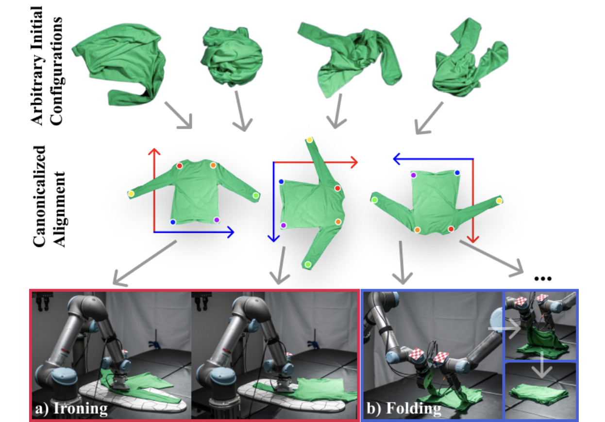

<h1> Cloth Funnels: Canonicalized-Alignment
for Multi-Purpose Garment Manipulation</h1>
<div style="text-align: center;">

[Alper Canberk](https://alpercanberk.github.io), [Cheng Chi](https://cheng-chi.github.io/), [Huy Ha](https://www.cs.columbia.edu/~huy/), [Benjamin Burchfiel](http://www.benburchfiel.com/), [Eric Cousineau](https://www.eacousineau.com/), [Siyuan Feng](https://www.cs.cmu.edu/~sfeng/), [Shuran Song](https://www.cs.columbia.edu/~shurans/)

Columbia University, New York, NY, United States

[International Conference on Robotics and Automation 2023](https://www.icra2023.org/) 

[Project Page](https://clothfunnels.cs.columbia.edu/) | [Video](https://www.youtube.com/watch?v=TkUn0b7mbj0&t=197s) | [Arxiv](https://arxiv.org/abs/2210.09347)

</div>

<!--  -->
<!-- center image above -->
<!-- <div style="display:flex; justify-content: center;">

</div> -->


<div align="center">
  
</div>


<br>

This repository contains code for training and evaluating [ClothFunnels](https://clothfunnels.cs.columbia.edu/) in simulation for Ubuntu 18.04.
It has been tested on machines with Nvidia GeForce RTX 2080 Ti and GeForce 3090 Ti.


If you find this codebase useful, consider citing:


<div style="display:flex;">
<div style="padding:10px">

```
@inproceedings{canberk2022clothfunnels,
	title={Cloth Funnels: Canonicalized-Alignment for Multi-Purpose Garment Manipulation},
	author={Canberk, Alper and Chi, Cheng and Ha, Huy and Burchfiel, Benjamin and Cousineau, Eric and Feng, Siyuan and Song, Shuran},
	booktitle={International Conference of Robotics and Automation (ICRA)},
	year={2022}
}
```

</div>

</div>

If you have any questions, please contact [me](https://alpercanberk.github.io/) at `ac4983 [at] cs [dot] columbia [dot] edu`.


# Table of Contents
- 1 [Simulation](#simulation)
  - 1.1 [Setup](#setup)
  - 1.2 [Evaluate Cloth Funnels](#evaluate-flingbot)
  - 1.3 [Train Cloth Funnels](#train-flingbot)
  - 1.4 [Generating new tasks](#generating-new-tasks)
<!-- - 2 [Real World](#real-world)
  - 2.1 [Real world setup](#real-world-setup)
  - 2.2 [Running Flingbot in the real world](#running-real-world-flingbot) -->

# Simulation
## Setup 🛠️ 

This section walks you through setting up the CUDA accelerated cloth simulation environment.
To start, install [Blender](https://www.blender.org/download/), [docker](https://docs.docker.com/engine/install/ubuntu/) and [nvidia-docker](https://github.com/NVIDIA/nvidia-docker#quickstart).

### Python Dependencies

We have prepared a conda YAML file which contains all the python dependencies.

```
conda env create -f environment.yml
pip install -e .
```

### Compiling the simulator

This codebases uses a CUDA accelerated cloth simulator which can load any arbitrary mesh to train a cloth unfolding policy.
The simulator is a fork of [PyFlex](https://github.com/YunzhuLi/PyFleX) from [Softgym](https://github.com/Xingyu-Lin/softgym), and requires a GPU to run.
We have provided a Dockerfile in this repo for compiling and using this simulation environment for training in Docker.

```
cd cloth_funnels
docker build -t cloth-funnels .
```

To launch the docker container, go to the `cloth_funnels` subdirectory, then run
```
export CLOTH_FUNNELS_PATH=${PWD}
nvidia-docker run \
	-v $CLOTH_FUNNELS_PATH:/workspace/cloth_funnels\
	-v /path/to/your/anaconda3:/path/to/your/anaconda3\
	--gpus all --shm-size=64gb  -d -e DISPLAY=$DISPLAY -e QT_X11_NO_MITSHM=1 -it cloth-funnels
```
You might need to change `--shm-size` appropriately for your system.

Add conda to PATH, then activate cloth-funnels
```sh
export PATH=/path/to/your/anaconda3/bin:$PATH
conda init bash
source ~/.bashrc
conda activate cloth-funnels
``` 
Then, inside the `cloth_funnels` directory within the docker container, compile the simulator with 
```
. ./prepare.sh && ./compile.sh
```
*NOTE: Always make sure you're in the correct conda environment before running these two shell scripts*.

The compilation will result in a `.so` shared object file. 
`./prepare.sh` sets the environment variables needed for compilation and also tells the python interpreter to look into the build directory containing the compiled `.so` file.

After this `.so` object file is created, you should be able to run experiments outside of docker as well as inside.
In my experience as well as [other's in the community](https://github.com/Xingyu-Lin/softgym/issues/5), docker is best used *only for compilation* and usually fails for running experiments.
If you experience this, try taking the compiled `.so` file and running the python commands in the sections to follow *outside of docker*.
Make sure you set the environment variables correctly using `./prepare.sh`.
Not setting `$PYTHONPATH` correctly will result in `ModuleNotFoundError: No module named 'pyflex'` when you try to `import pyflex`.

You can check out [Softgym's Docker guide](https://github.com/Xingyu-Lin/softgym/blob/master/docker/docker.md) and [Daniel Seita](https://danieltakeshi.github.io/)'s [blog post](https://danieltakeshi.github.io/2021/02/20/softgym/) on installing PyFlex with Docker for more information.
### Models + Task Dataset

You can download the pretrained models and the task dataset by running the following commands in the root directory
```sh
source download_models.sh
source download_tasks.sh
```
The models will be stored in `cloth-funnels/models/` and the datasets will be stored in `cloth-funnels/assets/tasks/`. If you would only like to download a small sample of the task dataset, you can run
```sh
source download_sample.sh
```
If you would like to create your own tasks, you should also run 
```sh
source download_cloth_data.sh
```

## Demo Cloth Funnels 😎

To run a demo on a single cloth instance, ensure that you have specified at least one GPU on the `CUDA_VISIBLE_DEVICES` environment variable, and run the following command from the root directory
```
python cloth_funnels/run_sim.py\
    name="demo-single" \
    load=../models/longsleeve_canonicalized_alignment.pth \
    eval_tasks=../assets/tasks/longsleeve-single.hdf5 \
    eval=True \
    num_processes=1 \
    episode_length=10 \
    wandb=disabled \
    fold_finish=True \
    dump_visualizations=True
```
The result will appear in the `cloth_funnels/experiments` directory under the name `demo-single`. Inside the experiment directory, you can find the episode replay buffer along with a video of the executed episode.

<div align="center">
  
</div>

## Evaluate Cloth Funnels 😯


To evaluate Cloth Funnels on the long sleeve task evaluation dataset of 200 randomized and crumpled cloth instances specified in the paper, ensure that you have the `multi-longsleeve-eval.hdf5` dataset in `assets/tasks/` and run the following command from the root directory

```sh
python cloth_funnels/run_sim.py name="longsleeve-eval"\
     load=../models/longsleeve_canonicalized_alignment.pth\
      eval_tasks=../assets/tasks/multi-longsleeve-eval.hdf5 \
      eval=True\
      num_processes=1 \
      episode_length=10 \
      wandb=disabled \
      fold_finish=True \
      dump_visualizations=True
```
If you have enough memory on your GPUs, you may specify more parallel environments with the `num_processes` flag.
Since the simulator is hardware accelerated, the maximum `num_processes` you can set will be limited by how much memory your GPU have.
You can also add `--dump_visualizations` to get videos of the episodes.

The output of evaluation is a directory in `cloth-funnels/experiments` whose name includes the date and `longsleeve-eval`.
You can print the summary statistics of the evaluation as follows
```
python cloth_funnels/scripts/eval_buffer.py \
  --path experiments/[path to run]
```
If you would like to visualize the evaluation episodes,
```
python cloth_funnels/scripts/episode_visualizer.py \
  --path experiments/[path to run]
```
The resulting plots will appear in the evaluatino directory under `visualizations/`.


## Train Cloth Funnels 🚂

Then train the model from scratch on long sleeve dataset, ensure you have downloaded the dataset using `download_dataset.sh`, and run the following command from the root directory.
```sh
python cloth_funnels/run_sim.py name="longsleeve" \
    num_processes=24
```
Make sure to change `num_processes` appropriately for your GPU memory capacity. Once the run starts, you can visualize the training on the corresponding Weights and Biases dashboard.


 If you would like resume a run, you may execute the following command
```
python cloth_funnels/run_sim.py cont=[path to run]
```

## Generating new tasks 👕👖

You can also generate canonicalized-alignment task datasets. Many of the task related scripts are found under the `cloth_funnels/tasks` directory. To generate 100 long sleeve tasks canonicalized alignment tasks, you may run the following command
```
python cloth_funnels/tasks/generate_tasks.py \\
  --mesh_category longsleeve.json 
  --path assets/tasks/multi-longsleeve-train.hdf5 
  --num_processes 8 
  --task_difficulty hard  
  --num_tasks 100 
  --randomize_direction 
  --random_translation 0.3
```
-  `mesh_category` parameter dictates the category of garments to use for generating the tasks. 
It could be any one of `longsleeve.json`, `pants.json`, `dress.json`, `jumpsuit.json`, `skirt.json`.

- `path` parameter dictates the path to the output hdf5 file. 

- `num_processes` parameter dictates the number of parallel processes to use for generating the tasks.

- `task_difficulty` parameter dictates how crumpled the generated cloth instances should be for the task. It could be `none`,`easy`, `hard`
- `randomize_direction` parameters dictates whether the direction of the cloths should be randomized.
- `random_translation` parameter dictates the maximum translation of the cloth instances in the task.


If you would like to recreate the training or evaluation task datasets that are mentioned in the paper for any given cloth category (longsleeve, pants, dress, jumpsuit, skirt), you may run
```sh
python cloth_funnels/tasks/generate_tasks_script.py [cloth_category]
```
where `cloth_category` is one of `longsleeve`, `pants`, `dress`, `jumpsuit`, `skirt`.

This will give you a command that includes various `generate_tasks` commands chained together. Running this command will generate the task dataset for the specified cloth category.


# Acknowledgements 🙏

- This codebase is heavily built on on [DextAIRity](https://github.com/columbia-ai-robotics/dextairity) and [FlingBot](https://flingbot.cs.columbia.edu/). 
- The keypoint detector framework is adapted from [IRP](https://irp.cs.columbia.edu/)
- The cloth simulator is a fork of [PyFlex](https://github.com/YunzhuLi/PyFleX) from [Softgym](https://github.com/Xingyu-Lin/softgym)

